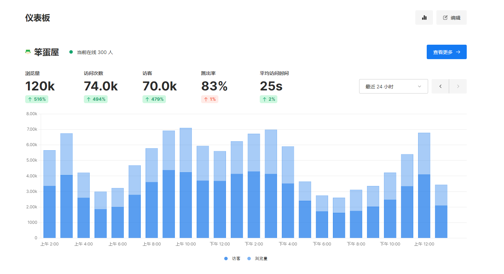
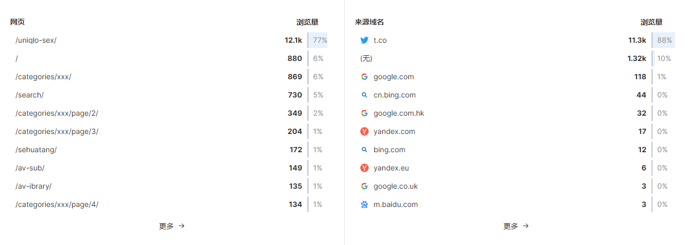
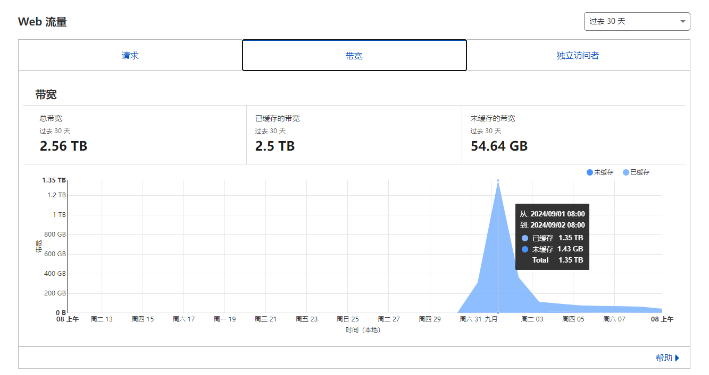

---

title: "突如其来300GB流量冲击：一次博客服务下线的教训"
description: ""
date: 2024-09-10
draft: false
image: umami-120k.png
categories: ["it"]
tags: ["博客"]
url: /300gb-traffic-crash-blog/
---

## 博客下线

2024 年 9 月 1 号凌晨 1 点左右突然睡醒，看了下手机，Uptime Kuma 提示博客下线，Beszel 提示 VPS 磁盘占用达到 80% 。

赶紧打开电脑，SSH 连不上 VPS ，VPS 后台显示刚重置的月流量已经用了三百多 GB ，后台重启 VPS 后终于能连上服务器了，博客也重新上线。

## 流量偷跑

运行博客的 VPS 总共 450GB/月 的流量，一觉醒来就没了300GB。

首先怀疑是部署在这台 VPS 上的梯子被盗用了，检查 X-UI 发现流量使用很正常，就算把 xray 服务停止了流量还在飞速流逝。

接着查看了下 NGINX 的日志，发现是 https://wp-archive.baka.li/2023/03/uniqlo-sex.mp4 被疯狂访问，这是 [三里屯优衣库试衣间事件视频](https://baka.li/uniqlo-sex/) ，在 2015 年事件爆火时顺便发布在博客的，突然间这么多人访问，第一反应是被人恶意刷流量了。

随即把视频挪到了 Cloudflare R2 的对象存储上，流量开始大幅下降，但仅仅在排查的十来分钟里又没了 50GB 流量。

## 故障原因

本博客是部署在 Github Pages 上，再通过一台 CN2GIA 线路的 VPS 进行反代。

由于 [三里屯优衣库试衣间事件视频](https://baka.li/uniqlo-sex/) 被频繁访问，导致 NGINX 的 proxy_temp_dir 目录爆满，这台只有 10GB 硬盘的 VPS 直接寄了。

> `proxy_temp_dir` 是一个临时目录，用于存储尚未完全接收到的上游响应。当 NGINX 从上游服务器获取响应时，如果响应较大或正在传输过程中，数据会先存储在 `proxy_temp_dir` 中。一旦接收完整，数据将被转移到 `proxy_cache_dir` 中。

再把视频挪到对象存储，不再经过 VPS 反代和缓存，以后不会再出现这种情况。

## 流量来源

前面说了，怀疑是被人恶意刷流量，毕竟确实有贱人喜欢干这种事。

不过当我打开 Umami （网站统计）时，看到了惊人的数据，近一天有 120K 的浏览量，把博客前十年的浏览量加起来还多。

主要浏览量来自[三里屯优衣库试衣间事件视频](https://baka.li/uniqlo-sex/) ，而来源域名几乎全是 t.co ，这是推特的跳转链接域名。

于是我去推特搜索了 “三里屯优衣库” ，终于破案了。

一位推特上六十多万粉的 PO 主转发了我这篇老古董博客。

## 赛博菩萨

不得不感叹，色情是第一生产力，流量真的可怕。

视频挪到 R2 对象存储十来天后，Cloudflare 已经帮我扛了 2.5TB 的流量了。

