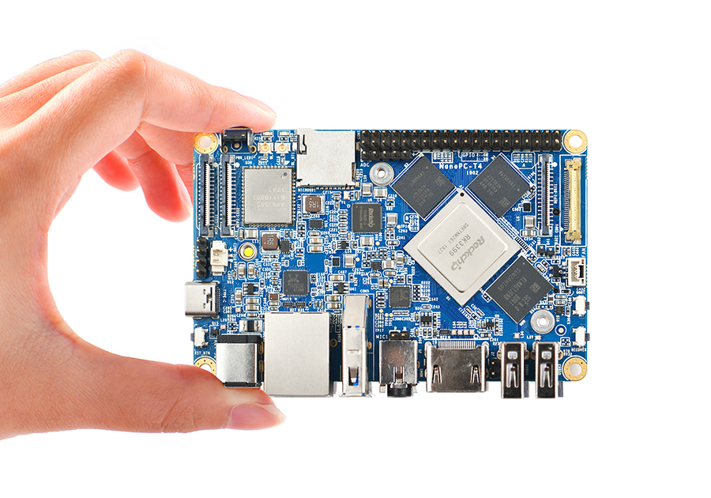

这是一台在闲鱼收的 ARM 开发板，打算外接个硬盘放回老家做备份服务器，可拖延症犯了一直没弄，当时价值200的板子都快破百元了。

## 先看配置

> - 主控芯片: Rockchip RK3399
>
> - CPU: big.LITTLE大小核架构，双Cortex-A72大核(up to 2.0GHz)+四Cortex-A53小核结构(up to 1.5GHz)
>
> - GPU: Mali-T864 GPU，支持OpenGL ES1.1/2.0/3.0/3.1, OpenCL, DX11, 支持AFBC（帧缓冲压缩）
>
> - VPU: 支持4K VP9 and 4K 10bits H265/H264 视频解码，高达60fps, 双VOP显示等视频编解码功能* 电源管理单元: RK808-D PMIC, 搭配独立DC/DC, 支持动态调压, 软件关机, 按键开机, RTC唤醒, 睡眠唤醒等功能
>
> - 内存: 双通道4GB LPDDR3-1866
>
> - Flash: 16GB eMMC 5.1 Flash
>
> - Wi-Fi/蓝牙: 802.11a/b/g/n/ac, Bluetooth 4.1 双频Wi-Fi蓝牙模块, 2x2 MIMO, 双天线
>
> - HDMI: HDMI 2.0a, 支持4K@60Hz显示，支持HDCP 1.4/2.2
>
> - USB 3.0: 1个原生USB 3.0 Host A型接口
>
> - PCIe: 一个 M.2 M-Key PCIe x4 接口, 兼容PCIe 2.1, 双操作模式, 带有M.2 2280模块M3固定螺柱

大部分功能我都是用不上的，就图他内存够大，有个 M2 NVME 接口和 USB 3.0 。

## 安装系统

系统选择 Armbian ，专为开发板和电视盒子适配的发行版。

安装起来也很简单，在官网找到合适的镜像，用写盘工具写入 SD 卡中，开发板插上 SD 卡开机就能进系统了。

本来打算在 M2 NVME 上接一块淘汰的 SSD 的，后来觉得浪费，又买了块十几块钱的傲腾 16GB 硬盘来放系统，比 SD 卡和板子自带的 EMMC 靠谱很多。（现在不用傲腾以后这辈子没机会用上了）