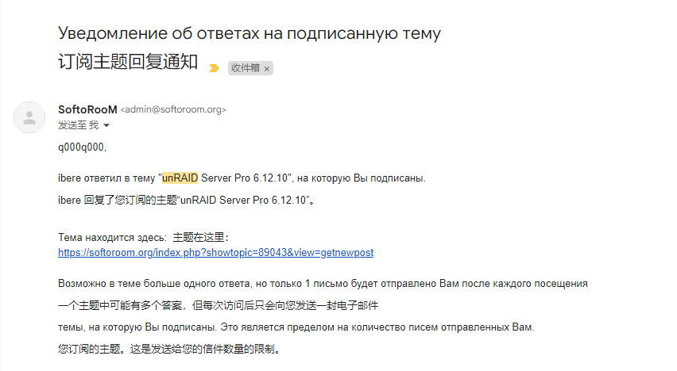
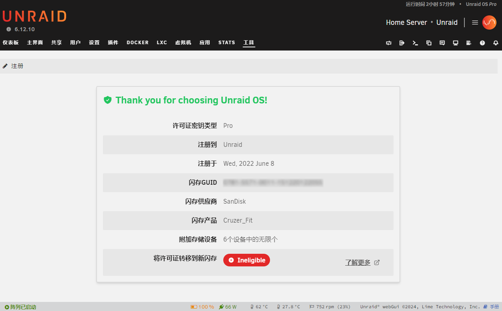

## 终极大无语事件

年初听说了 UNRAID 系统要变成订阅制，便一直关注，想着涨价的话就趁着末班车入正，真的挺好用的。

> Q：新付费模式的价格是否会提前通知用户并给到缓冲时间？
> 
> A：会的。
> 官方将来会提供一周的缓冲时间，来让那些正在试用的用户做出决定。
> 根据官方的说明，官方计划在 2024 年第一季度末发布新付费模式的相关具体内容。所有当前试用用户将会收到相关的电子邮件通知。一旦新付费模式正式执行，试用用户将只能选择新付费模式下的许可证，因为 Basic 、Plus 和 Pro 许可证将不再提供购买。

我订阅了 [JackieWu](https://www.jackiewu.top/article/unraid-new-license-keys) 这个一直发布 UNRAID 教程的博客的 RSS ，以便及时获取消息。

不出意外就出意外了，他博客的 RSS 抽了，当我刷到 **[2024 Unraid 新付费制解读](https://www.jackiewu.top/article/unraid-new-license-keys#b28e5c50abb84ef7b26b9340ff40fc21)** 这篇文章的时候 UNRAID 价格已经翻倍了 😭😭😭！

那就先继续用着开心版吧。

## 下载开心版

目前我使用的 Tank电玩&米多贝克 的 [UNRAID 6.12.4 开心版](https://www.mi-d.cn/9519) ，官方版已经更新到了 6.12.10 了，他家的半年没更新了。

去毛子论坛看了下，毛子版本更新到了 6.12.9 ，订阅了那个帖子，没几天就更新了 6.12.10 ，但我懒癌发作拖到今天才升级。



UNRAID 6.12.4 和 6.12.10 隔的几个小版本都是以 BUG 修复为主，直接升级应该问题不大，下载链接：

**[unRAID Server Pro 6.12.10, ОС и ваши данные в безопасности, OS performance, VMs](https://softoroom.org/topic89043s150.html)**

## 安装升级

切记，升级前先备份 U 盘。

把 unraid_crack/unraid-new/ 目录的 hook.so 和 unraider 两个文件拷贝到原系统 U 盘的 config 目录内。

删除原系统 U 盘除 config 目录之外的其他所有目录和文件。

编辑 config 目录里的 go 文件，填入下面的内容保存， U 盘的 GUID 可以通过 ChipGenius 查看。

```
#!/bin/bash
export UNRAID_GUID=填你U盘的GUID
export UNRAID_NAME=Tower
export UNRAID_DATE=1654646400
export UNRAID_VERSION=Pro
/lib64/ld-linux-x86-64.so.2 /boot/config/unraider
# Start the Management Utility
/usr/local/sbin/emhttp & 
```

把 unRAIDServer-6.12.10-x86_64.zip 解压，删除掉 config 目录后把所有文件和目录都拷贝进 U 盘根目录即可。

不出意外就升级成功了。

