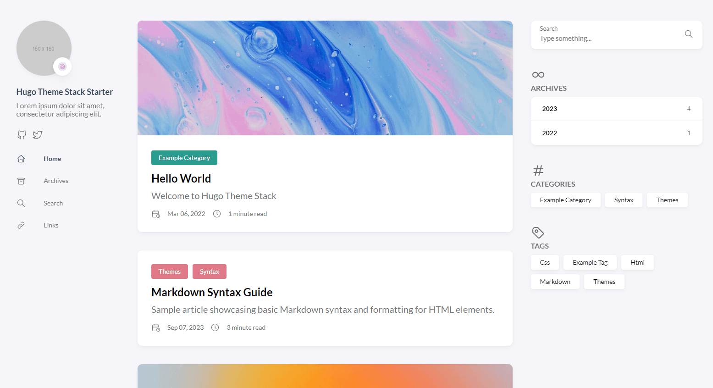
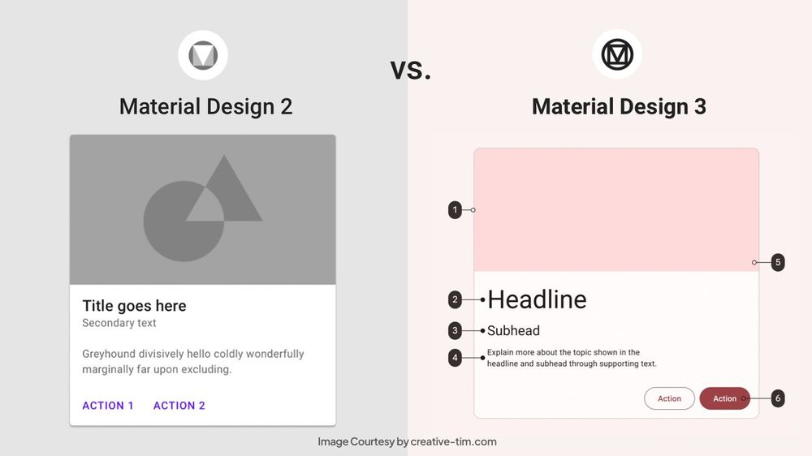
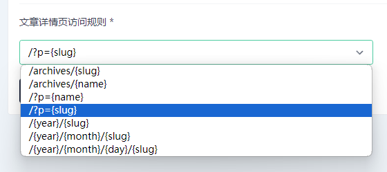
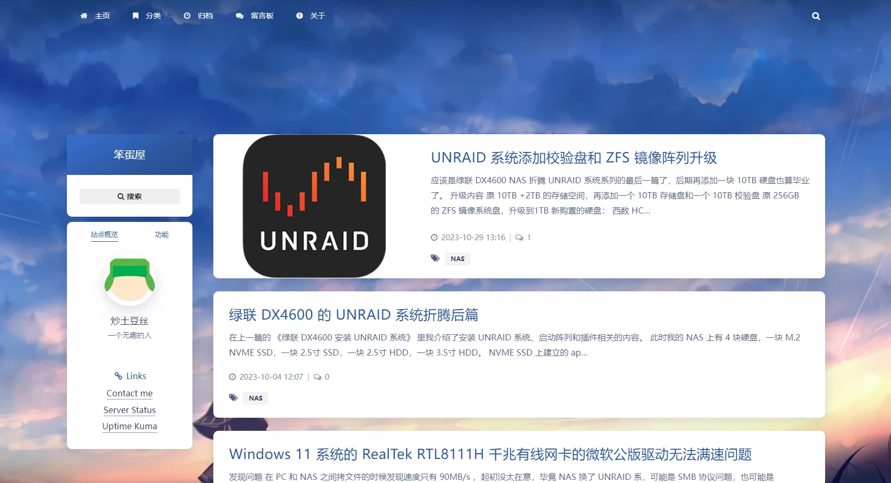
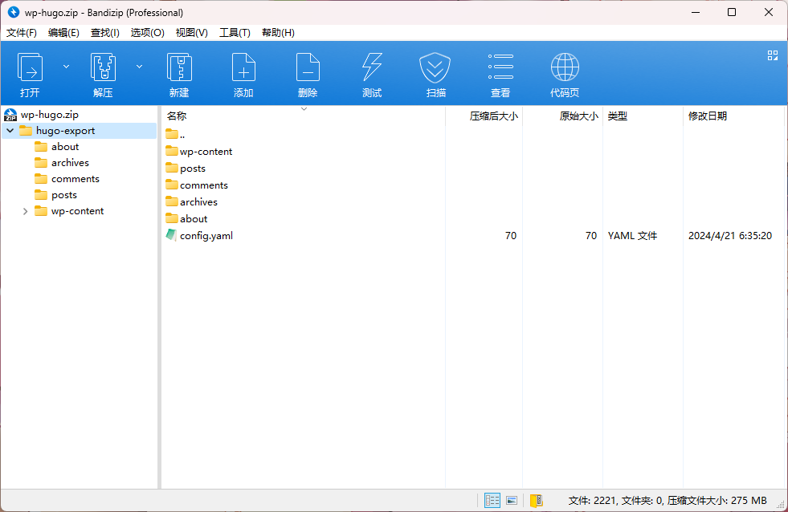
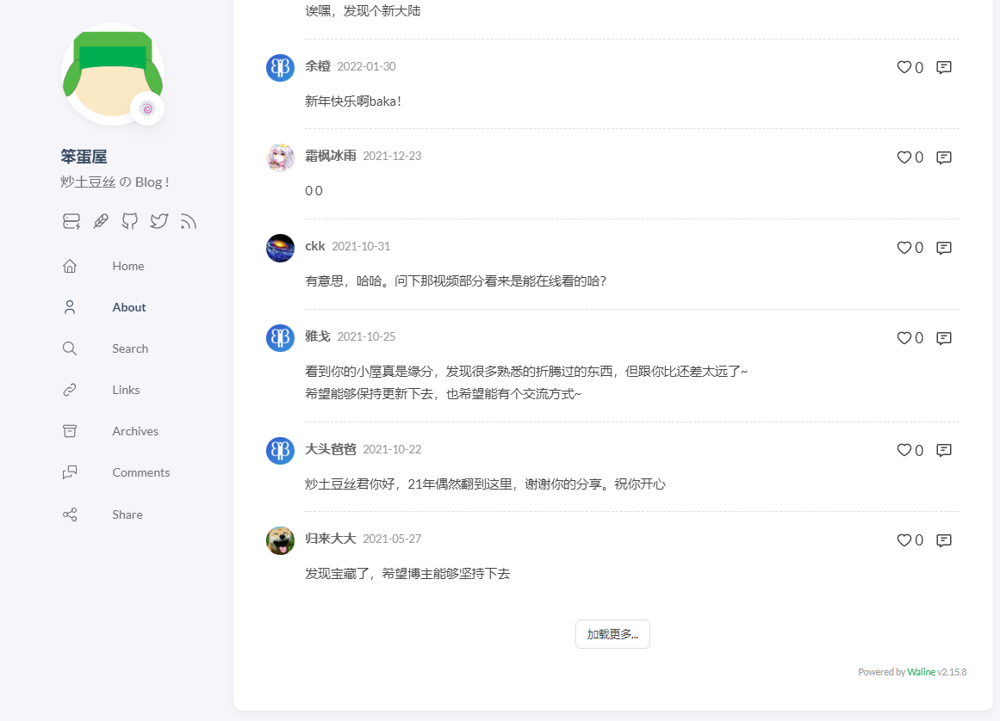
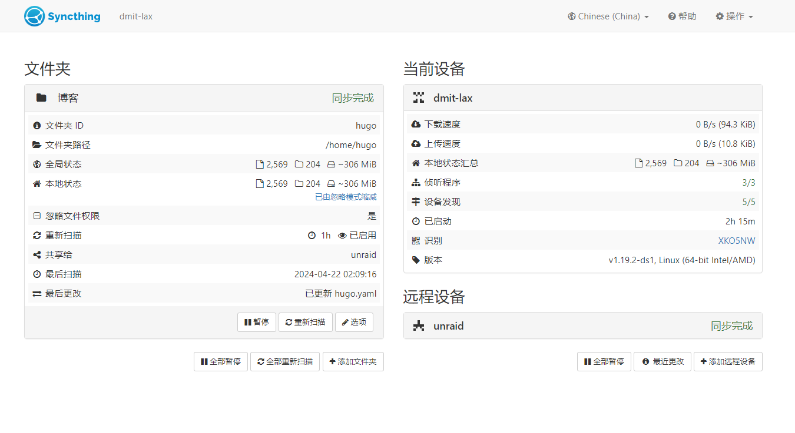
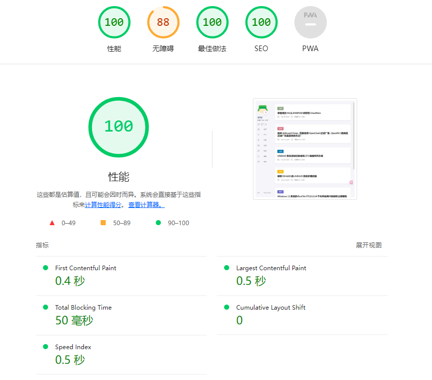

## 缘起

无意中看到一个博客，主题非常好看，第一眼就喜欢上了。

[Hugo Theme Stack](https://github.com/CaiJimmy/hugo-theme-stack)

这是一个 Hugo 博客主题，作者 CaiJimmy ，在 Github 上有 4.3K 的 Star 。



主题风格像谷歌的 Material You，我搜了 Wordpres 相关的主题，都是旧的 Material Design 2 的主题，如 [MDx](https://github.com/yrccondor/mdx) ，不如新的好看，而且大多不维护了。



很神奇的事是，作为最被广泛使用的博客平台 Wordpress ，没人移植这个主题，反而比较小众的 Halo ，有人移植了。

[Halo Theme Stack](https://github.com/jiewenhuang/halo-theme-stack)

## 尝试 Halo 

为了用上喜欢的主题，我决定试一下 Halo 。

Halo 部署起来非常方便，两三下就搞定了，把 Wordpress 文章导入 Halo 后发现不对劲了。

我在 WP 中使用的固定链接格式是 https://baka.li/post ，这样很简洁。

而 Halo 无法设置这种固定链接，会在文章名前面加上 ?p= 符号，导致 URL 变成 https://baka.li/?p=post ，这会影响网站的 SEO 。



还有一点，Halo 后端用 JAVA 编写，我不懂编程，但我知道用了 JAVA 的程序都很吃资源...

事实也如此，对比我使用了 Redis 和 [WP Rocket](https://wp-rocket.me/) 做了页面缓存的 WP 博客，Halo 速度反而更慢了。

所以，我放弃了。

## 告别 Wordpress

这个 WP 博客已经运行十多年了，讲真，我不太喜欢它。

我的 VPS 都是单核 1GB 内存的，运行起来真的很吃力，编辑器很难用，让人没有写博客的欲望。

最最最重要的是，WP 实在缺好看的个人博客主题。[Argon-Theme](https://github.com/solstice23/argon-theme) 是我为数不多喜欢的，可惜作者已经弃坑，就趁着这机会迁移到 Hugo 吧。

存图纪念一下，感谢 [archive.org](https://web.archive.org/web/20240314122423/https://baka.li/) 。



## 迁移博客

### 转换并导出 WP 文章与评论

先做好数据库备份，停用各种插件，再在 Wordpress 自带的导出里导出 .xml  格式的备份，等下需要它来迁移评论数据。

去 Github 下载 [WordPress to Hugo Exporter](https://github.com/SchumacherFM/wordpress-to-hugo-exporter) ，导入 WP 并安装。

SSH 连接主机，进入插件目录，运行 php hugo-export-cli.php /home  导出，直接报错。

```
php hugo-export-cli.php /home
[INFO] Start to export data to configured folder /home/PHP Fatal error:  Duplicate declaration of static variable $inde
nt in /www/wwwroot/blog/wp-content/plugins/wordpress-to-hugo-exporter/includes/markdownify/Converter.php on line 559 
```

我问了 ChatGPT ，它给了很多愚蠢的回答，害我折腾了几小时。

直接谷歌第一个链接就解决问题，把 PHP 8.3 换成 PHP 8.0 就不会报错了。

### 导入文章并本机测试

参考 [Hugo：Stack主题- 建站指南](https://site.zhelper.net/Hugo/hugo-stack/) 这篇教程，在 Windows 上安装 Hugo 和配置 Stack 主题。

把 Wordpress 导出文件拉回本机解压，以我导出的文件为例。

wp-content 是 WP 的文件目录，主要是图片，把它拷贝到 Hugo 的 content 目录。

posts 目录内的是转换成 Markdown 格式的 WP 文章，拷贝到 content/post 目录。

剩下的几个目录是我的 WP 页面，拷贝到 content/page 目录，config.yaml 记录了网站名和描述，这个不用拷贝过去，用 Stack 主题自带的 exampleSite 配置 config.yaml 就行。



拷贝完文件后运行 hugo server 在本机检查有没有问题。

wordpress-to-hugo-exporter 插件导出文章可能会有些没转换好格式，需要手动修改。

反正先慢慢摸索，大概把 Hugo 玩明白了再部署网站。

## 在 VPS 上部署 Hugo

像 Hexo 和 Hugo 这种静态博客，使用者大多是程序员，Hugo 博客大多数是部署在 Github Pages 上的。

我不懂编程，也不会用 Git ，但我的 VPS 性能还不错，并且是 CN2GIA 线路的，所以我选择部署自己 VPS 上，在中国大陆的访问速度会比 Github Pages 更快。

### Debian 安装 Hugo

APT 安装的版本较老，所以去 [Github](https://github.com/gohugoio/hugo/releases) 直接下载 .deb 包安装，要下载 extended 版本。

```
wget https://github.com/gohugoio/hugo/releases/download/v0.125.2/hugo_extended_0.125.2_linux-amd64.deb
dpkg -i hugo_extended_0.125.2_linux-amd64.deb
```

安装完成后检查版本。

```
hugo version
```

### 运行 Hugo

把本机的 hugo 博客目录打包上传到 VPS 上，在 hugo 目录运行：

`hugo server --appendPort=false --baseURL="https://baka.li"`

如果不加 --appendPort  参数会导致搜索无法使用。

运行后会在 hugo 目录生成 public 目录，用 Nginx 配置的静态网站指向这个目录，再配置好证书就可以访问了。

##  评论系统

### 部署 Waline

因为是静态网页，所以需要评论功能的话要引入第三方评论系统，这里我选择 Waline ，一款简洁、安全的评论系统。

Waline 官方推荐部署在 Vercel 这种 [PaaS](https://zh.wikipedia.org/wiki/%E5%B9%B3%E5%8F%B0%E5%8D%B3%E6%9C%8D%E5%8A%A1) 平台，参考 [Waline 快速上手](https://waline.js.org/guide/get-started/) ，文档写得很详细。

### 迁移评论

不过 Waline 本身并不支持导入 Wordpress 的评论，这里需要用到 **ceeji** 大佬写的[脚本](https://ceeji.net/blog/migrate-from-wordpress-to-hugo/#%E4%BB%8E-wordpress-%E8%AF%84%E8%AE%BA%E8%BF%81%E7%A7%BB%E5%88%B0-waline)，把 Wordpress 导出的 .xml 备份文件转成可以导入 Waline 的 .json 文件。

参考 [从 Wordpress 评论迁移到 Waline](https://ceeji.net/blog/migrate-from-wordpress-to-hugo/#%E4%BB%8E-wordpress-%E8%AF%84%E8%AE%BA%E8%BF%81%E7%A7%BB%E5%88%B0-waline) 这篇文章。

不过把转换好后台导入后发现 URL 有问题。

需要把 url 字段的域名去掉，例如我需要批量把 "url": "https://baka.li/about/" 改成 "url": "/about/" ，然后再重新导入 Waline 。

1500多条评论成功迁移。



## 同步

成功部署到 VPS 后发现想修改文章或者主题有点麻烦，可能这也是更多人选择用 Github 部署的原因吧。

为了方便，我安装了 Syncthing 在服务器和本机上双向同步 Hugo 目录。

这样修改了内容基本秒是同步的，记得排除掉 VPS 的 public/* 目录。



## Hugo 的使用体验

一个字，快！

才发现自己的网站也可以这么快！没有 Wordpress 这种便秘的感觉了。

用 Typora 在本机写东西也很舒服。



## 参考

[Hugo：Stack主题- 建站指南](https://site.zhelper.net/Hugo/hugo-stack/)

[Getting Started | Stack](https://stack.jimmycai.com/guide/getting-started)

[从 Wordpress 迁移到 Hugo 简要记录](https://blog.cysi.me/2022/05/migrate-to-hugo.html)

[(1) 带着Stack主题入坑Hugo](https://blog.linsnow.cn/p/join-hugo-and-stack/)

[Waline 快速上手](https://waline.js.org/guide/get-started/)

[Waline私有化部署(Docker+VPS)](https://blog.cuger.cn/p/859b/)

[Waline部署记录](https://mocusez.site/posts/4cf.html)

[建站技术 | 使用 Hugo+Stack 简单搭建一个博客](https://blog.reincarnatey.net/2023/build-hugo-blog-with-stack-mod/)

[Hugo 搭配 Nginx 反代使用](https://blog.mitsea.com/d1d694eeae164f16ae2b727fcd679eed/)

[Hugo Stack主题装修笔记](https://thirdshire.com/hugo-stack-renovation/)

[从 Wordpress 评论迁移到 Waline](https://ceeji.net/blog/migrate-from-wordpress-to-hugo/#%E4%BB%8E-wordpress-%E8%AF%84%E8%AE%BA%E8%BF%81%E7%A7%BB%E5%88%B0-waline)

[抛弃百度网盘同步盘，自建开源免费的全平台数据同步神器 Syncthing —— Unraid Docker 66](https://www.bilibili.com/video/BV1ki4y1h7WF/?spm_id_from=333.337.search-card.all.click&vd_source=18bff3de1dac07e2a9fb0eac3f260a1d)
