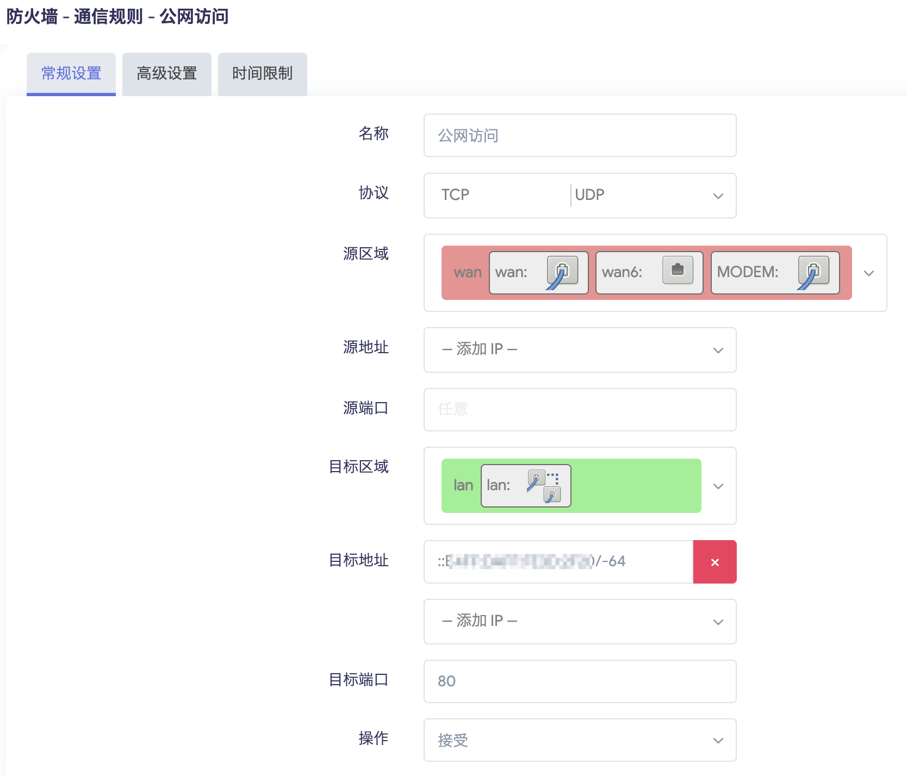
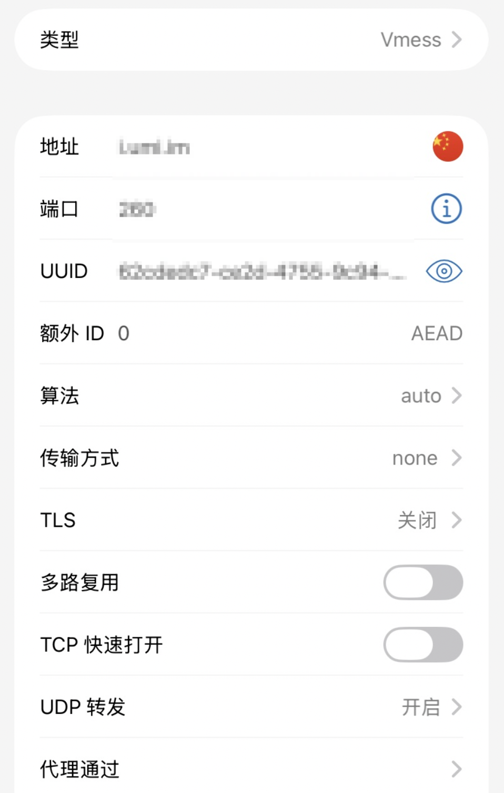
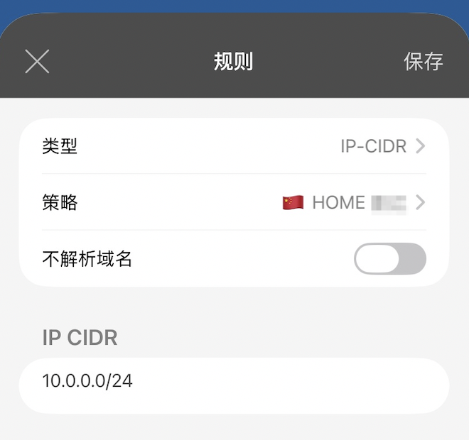

作为一位 Homelab 爱好者，家里部署了很多自托管服务，出门在外访问的家里的服务，VPN 就是离不开的，在我家宽带还有公网 IPv4 的时候，这是很简单的事。

Homelab 上启动个 v2ray ，配置好 DDNS 和端口转发，连回家轻而易举。

但前段时间搬家后宽带的公网 IPv4 掉了，无论怎么投诉电信就是死活不肯恢复，被迫要研究 IPv6 回家了。

## 设备

TP XDR6086 路由器 (OpenWrt)

RK3588 开发板 (Armbian)

iPhone (Shadowrocket)

## v2ray 配置

为了方便直接使用 VMESS + TCP 协议，使用 Docker 部署在 RK3588 开发板上，因为是 arm64 设备所以用的 teddysun/v2ray 这个镜像。

`docker run -d --net=host --name v2ray --restart=always -v /home/v2ray:/etc/v2ray teddysun/v2ray`

config.json 配置相比 IPv4 方案，要把监听端口改成 :: 才能监听到 IPv6，踩到过这坑。

端口随意，UUID 用 [Online UUID Generator](https://www.uuidgenerator.net/version4)  生成。

```
{
    "log": {
        "loglevel": "warning"
    },
    "inbounds": [
        {
            "listen": "::",
            "port": 端口,
            "protocol": "vmess",
            "settings": {
                "clients": [
                    {
                        "id": "UUID"
                    }
                ]
            },
            "streamSettings": { 
                "network": "tcp"
            }
        }
    ],
    "outbounds": [
        {
            "protocol": "freedom",
            "tag": "direct"
        }
    ]
}
```

## IPv6 DDNS 配置

我使用 DDNS GO 以及 Cloudflard DDNS 上报 IPv6 ，参考 [DDNS-GO + Cloudflare 解决动态 IP 变化](https://lijianfei.com/post/yi-jian-gao-ding-cloudflare-dns-zi-dong-geng-xin-gao-bie-shou-dong-fan-suo/) 。

IPv6 获取方式：通过命令获取， lan 替换成自己的网卡名称。

`ip -6 addr show dev lan scope global | grep inet6 | awk '{print $2}' | grep -v '^fc' | grep -v '^fd' | cut -d/ -f1 | head -n 1`

## 开发板的 IPv6 配置

为了方便配置 IPv6 防火墙，需要让设备拥有固定后缀的 IPv6 地址，开启 IPv6 eui64 。

这样设备会根据网卡的 mac 地址生成固定后缀的 IPv6 地址，在 [EUI-64 Calculator](https://eui64-calc.princelle.org/) 可以计算生成的后缀。

我的开发板系统是基于 Debian 13 的 Armbian ，使用 NetworkManager 管理网络。

NetworkManager 启用 eui64：

```
#查看连接名为 Wired connection 1
nmcli connection show   

NAME                UUID                                  TYPE      DEVICE          
Wired connection 1  570d0089-31d7-3e49-bf1a-0cd1954c9804  ethernet  lan

#修改  Wired connection 1  为 eui64 模式

nmcli connection modify "Wired connection 1" ipv6.method auto
nmcli connection modify "Wired connection 1" ipv6.addr-gen-mode eui64

#重启 NetworkManager
systemctl restart NetworkManager
```

## OpenWrt IPv6 eui64配置

路由器上也需要配置 eui64 ，参考：[OpenWrt-IPv6-设置方案 ](https://github.com/Aethersailor/Custom_OpenClash_Rules/wiki/OpenWrt-IPv6-%E8%AE%BE%E7%BD%AE%E6%96%B9%E6%A1%88)

网络 - 接口 - LAN - 高级设置 -  IPv6 后缀：eui64

网络 - 接口 - LAN - DHCP 服务器 - IPv6 设置 - 本地 IPV6 DNS 服务器 = ❌

网络 - 接口 - LAN - DHCP 服务器 - IPv6 设置 - DHCPv6 服务 = 禁用

网络 - 接口 - LAN - DHCP 服务器 - IPv6 RA 设置 - 默认路由器 ：存在可用后缀时

网络 - 接口 - LAN - DHCP 服务器 - IPv6 RA 设置 - RA标记 ：无

网络 - 接口 - LAN - DHCP 服务器 - IPv6 RA 设置 - 启用 SLACC ☑️

## OpenWrt IPv6 防火墙配置

在 网络 - 防火墙 - 通信规则 里添加一条规则，目标地址填 ::IPv6后缀/-64 ，源区域： WAN ，端口填 v2ray 配置的端口，参考我的：



## Shadowrocket 配置

节点配置较为简单，填上 DDNS 地址 、端口、UUID ，其他配置参考我的：



### 回家配置

我家的网段是 10.0.0.0/24 ，下面配置 10.0.0.0/24 网段走家里的 VMESS 节点，做到爬墙回家的分流。

配置文件的“通用”里，分别在“跳过代理”和 tun 旁路路由”下把 10.0.0.0/24 删除。

设置 - 隧道 - 包括所有网络 - 包括本地网络 ✅

最后在配置文件的“规则”里添加一条规则，类型选 IP- CIDR ，策略选家里的 VMESS 节点，IP CIDR填 10.0.0.0/24 。



这样 IPv6 回家就配置好了。

## IPv4 Frp 回家

有的公司商场的 WiFi 可能没有 IPv6 ，为了在这些地方回家，可以再套一层 Frp 。

前提你有一台 VPS ，部署好 FRP ，给家里的 VMESS 节点套一层 Frp ，这样在商场就用套了 Frp 的节点回家。

### Frpc

```
[[proxies]]
name = "vmess"
type = "tcp"
localIP = "10.0.0.x"
localPort = 本地端口
remotePort = VPS 端口
```

复制家里 VMESS 节点，把地址端口修改成 Frp 配置的，就有一个 VMESS 回家节点加上一个套了 Frp 的 VMESS 回家节点。

打开 Shadowrocket 的全配置局里面的 启动回退 ，这还有个分组功能，添加一个回家分组，把 VMESS 节点和套了 Frp 的 VMESS 节点放进去，VMESS 节点排在第一，规则里的策略就可以选择回家分组。

这样在有 IPv6 的情景下回家会走 VMESS 节点，没有 IPv6 的情景会走 VMESS Frp 节点。

以上基本应付了出门在家回家的问题。
