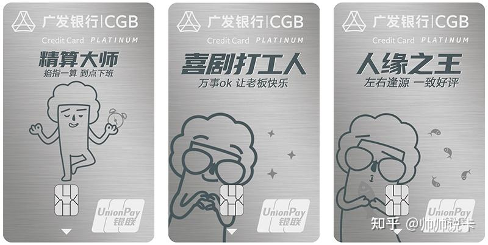
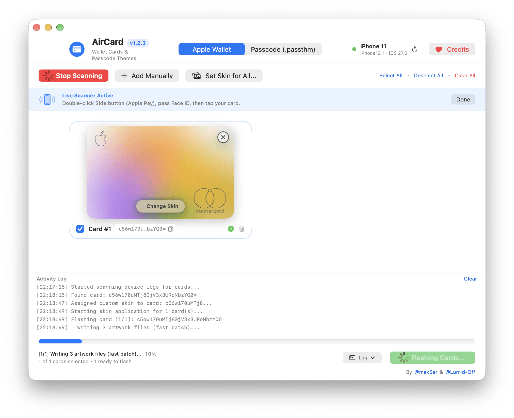
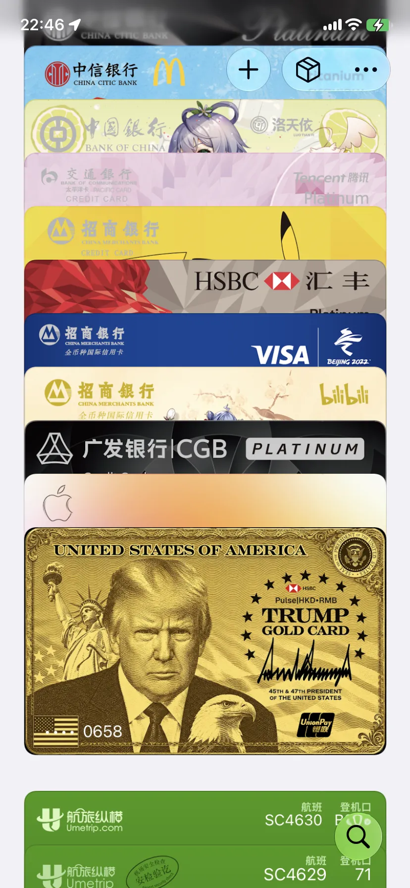
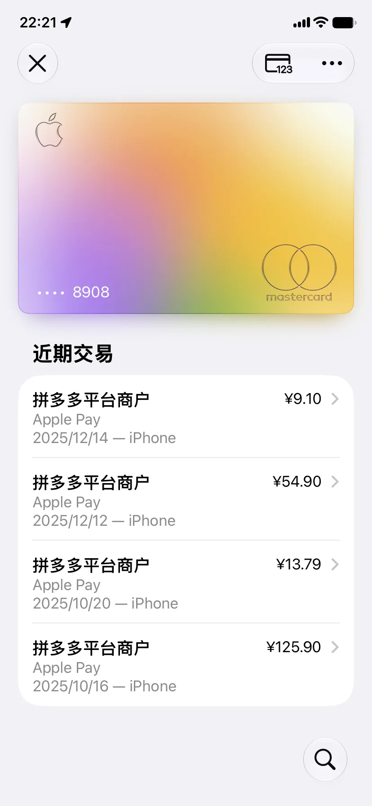
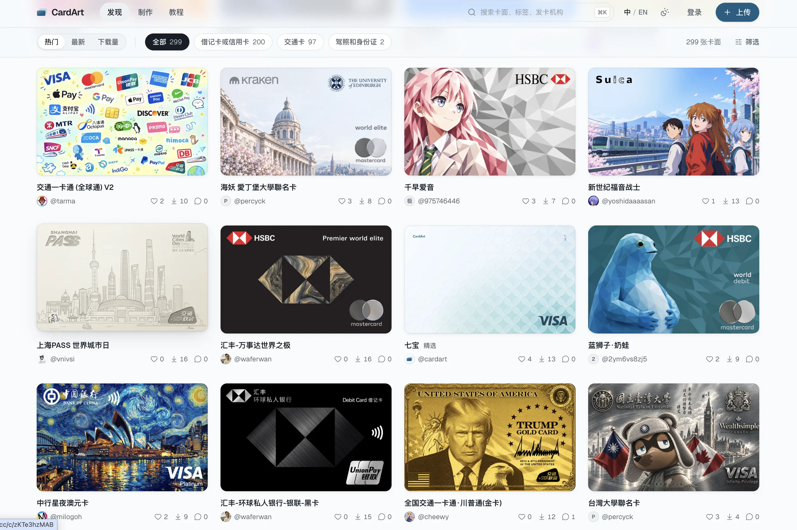

我的主力信用卡是广发的多利卡，曾经很火的返现卡，现已温暖升级。还有些返利金没兑换，要接着用，此卡最大的问题是卡面巨丑无比 ，它长这样：

刷推刷到一个关于修改 Apple Pay 卡面的项目，正好解决卡面过丑的问题。

顺便也给岭南通也换个卡面，这玩意卡面还是收费的，买个卡面还会过期...

## 使用

在 Github 上下载安装并打开 [Mak5er/AirCard](https://github.com/Mak5er/AirCard) ，手机连接到 Mac ，扫描，打开  Apple Pay 选卡再刷下 Face ID ，轻点卡片，卡片就出现在 AirCard 的界面，就可以上传自定义的卡面图片并刷写。

iOS 大版本更新可能会恢复原卡面，需重新刷写。

没 Mac 的用这个 Windows 客户端：[Lumid-Off/*AirCard*-Windows](https://github.com/Lumid-Off/AirCard-Windows)

## 效果

## 卡面素材

找到两个下载和制作卡面的网站，有很多有意思的卡面。

https://cards.no2.ac/

https://cardart.cc/

