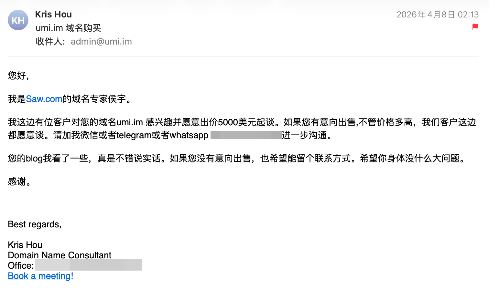
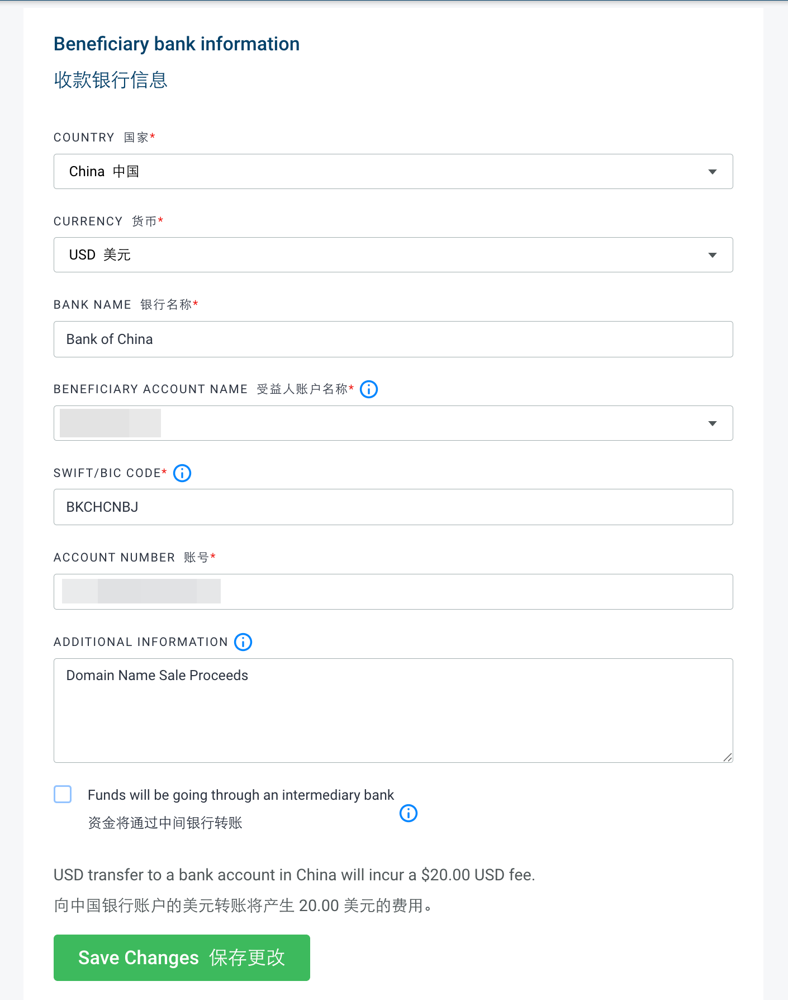
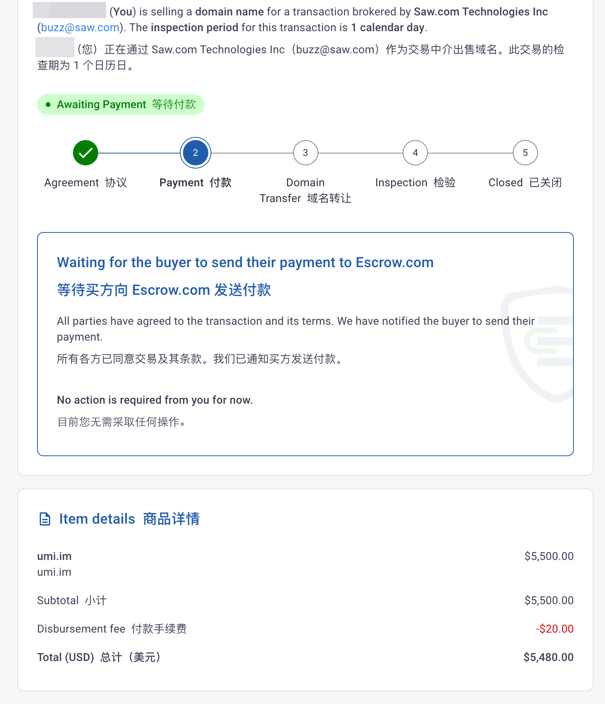
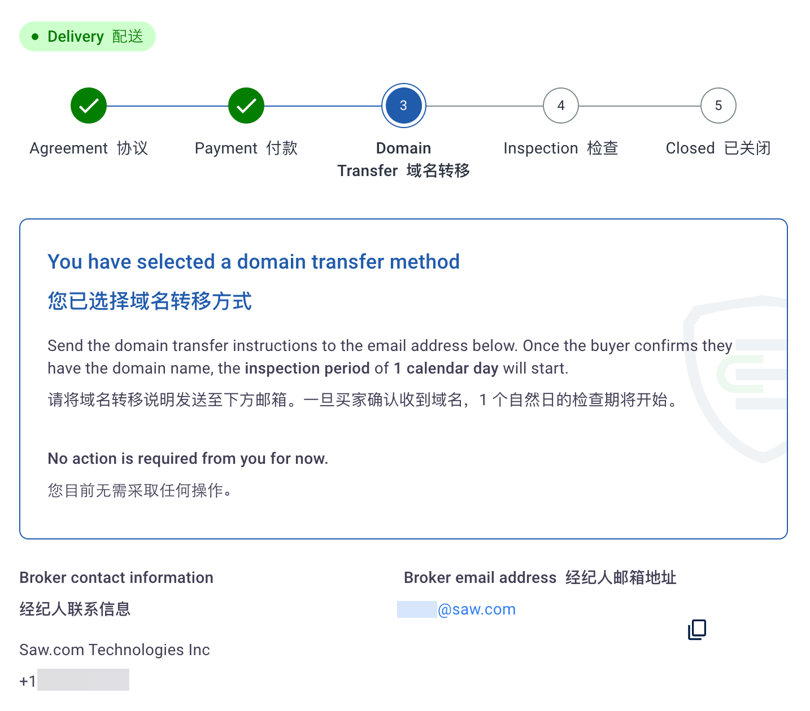
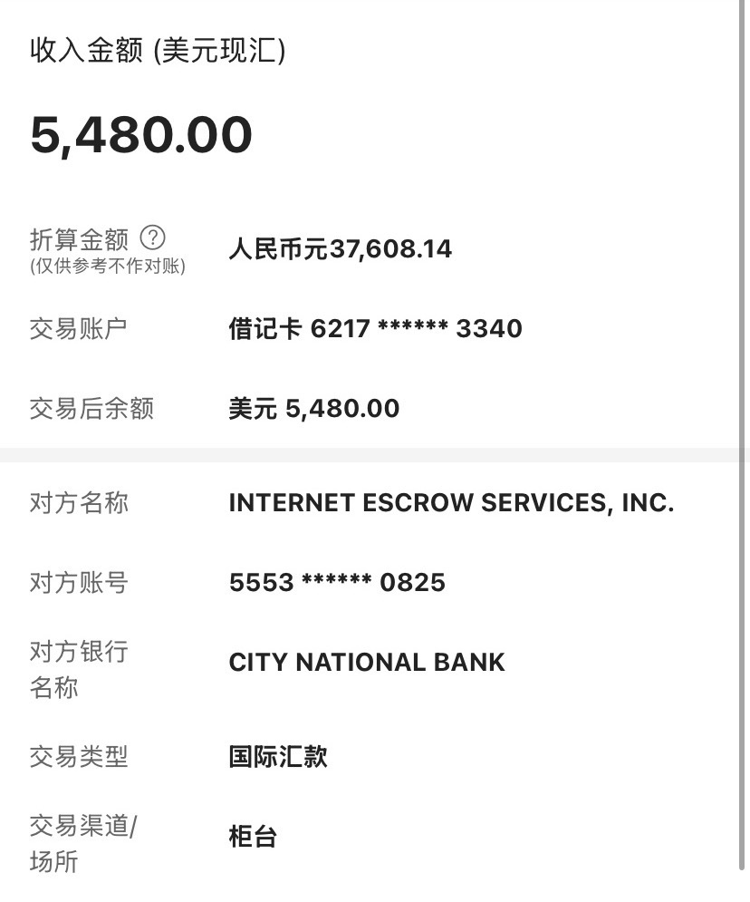
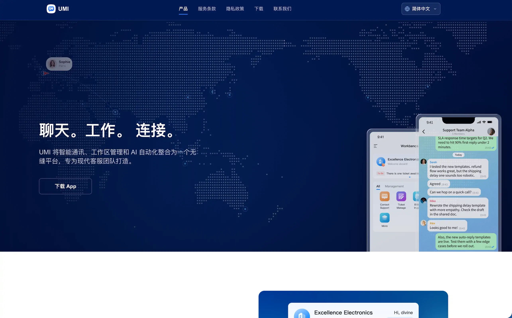

## 邮件询价

4 月 8 号，我的域名邮箱收到了封邮件，一个自称是 Saw.com 的域名中介向我的域名 umi.im 开价 5000 美元收购。

从 2018 年注册这个域名开始到现在这 8 年，还从来没有人向我的域名询价，更别说直接开价 5000 美元。

这域名注册的时候才 12.99 美元一年，后面注册局换到 Spaceship 后更是低到 6.73 美元一年。怎么可能有人要出 5000 美元来买，首先感觉就是诈骗邮件。

邮件是通过 sawbrokers.com 的企业邮箱发来的，Gemini 说确实是 Saw.com (知名域名中介) 的邮件，Kris Hou (侯宇) 确实是该公司的资深经纪人。

先尝试交流一下。

## 交易方案

后续几轮交流确定了最终价格并加上了中介的微信，着手开始交易。

在这之前我没有域名交易的经验，中介推荐我通过 [Escrow](https://www.escrow.com/) 交易。

查了下 Escrow  ，美国一家第三方担保交易平台，类似淘宝，发起交易后买家打钱给担保平台，卖家把域名转移码发送给买家，买家确认收货后平台打款给卖家。

Escrow 甚至能交易房产，还有人做外贸也用这个，比较靠谱。

## 交易过程

首先我注册 Escrow 账号，用真实资料注册，不需要 KYC。

把 Escrow 账号告诉给中介，由他发起交易，然后会收到 Escrow 的邮件，检查交易事项接着填写收款方式。

收款方式选择电汇 (Wire Transfer)，我用的是中国银行，需要填写拼音名，名在前姓在后，还需要填写银行的 SWIFT Code ，八位字母，中行的是 BKCHCNBJ 。

备注我填了 Domain Name Sale Proceeds 。

完事后等待卖家付款。

经过几天等待，买家终于付款了，要去域名注册商后台申请域名转移码发给买家让他来接收域名。

按理说应该在 Escrow 的交易页面填写域名转移码，但是这也没有地方填。

中介通过微信让我把域名转移码直接微信发他，这时我感觉有点不对劲。

Escrow 的交易说明也只写了 “请将域名转移说明发送至下方邮箱” ，很模糊的说明。

保险起见，把域名转移码通过邮件发送给了交易页面显示的 saw.com 的邮箱，再微信让中介去邮件查看。

经过几天的拉扯，交易终于完成。

在交易完成前我还不太信这域名真的能卖出去，交易完成当天火急火燎的买了新域名并完成博客的迁移。

没有做好 301 跳转导致 SEO 全废了，流量暴跌，好在不靠这个赚钱。

## 银行到账

电汇的到账需要 1 ~ 3 个工作日，4 月 30 号收到中行的电话，让我提交 **资金来源用途证明材料**，还需要一份 **资金来源说明** 并附上签名，可手写，再把邮箱给他，他会发一封邮件过来，通过邮件提交。

资金来源用途证明材料 直接用  Escrow 的交易详情截图，资金来源说明 我直接手写，说这是域名交易的个人服务合法收入之类的，写完拍照直接发。

由于五一假期银行放假，过一个多星期才收到了汇款。

收到汇款后还要在中行 APP 进行结汇才能最终变成人民币存款。

## 胡言乱语

仅此记录，简中互联网通过 Escrow 交易域名的内容很有限，很多我都得问 AI 操作。

域名出售几天后，卖家终于上线了 [umi.im](https://umi.im) ，一个叫 UMI 的即时通讯 APP 的官网，怪不得要买我的 .im 域名。

😭 看样子他们公司也不小，感觉卖便宜了。

