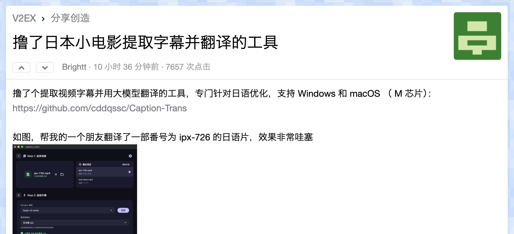
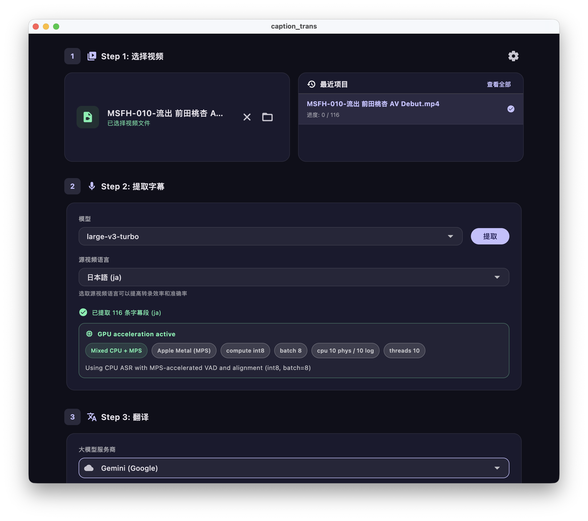
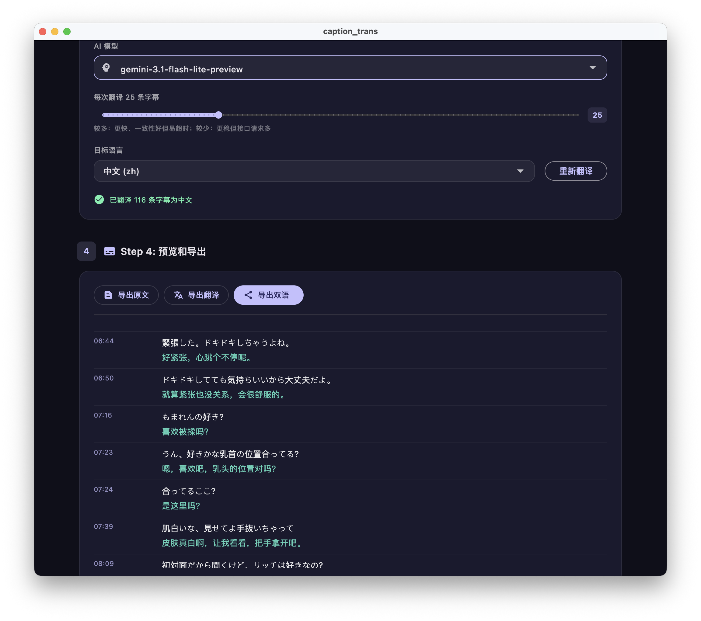
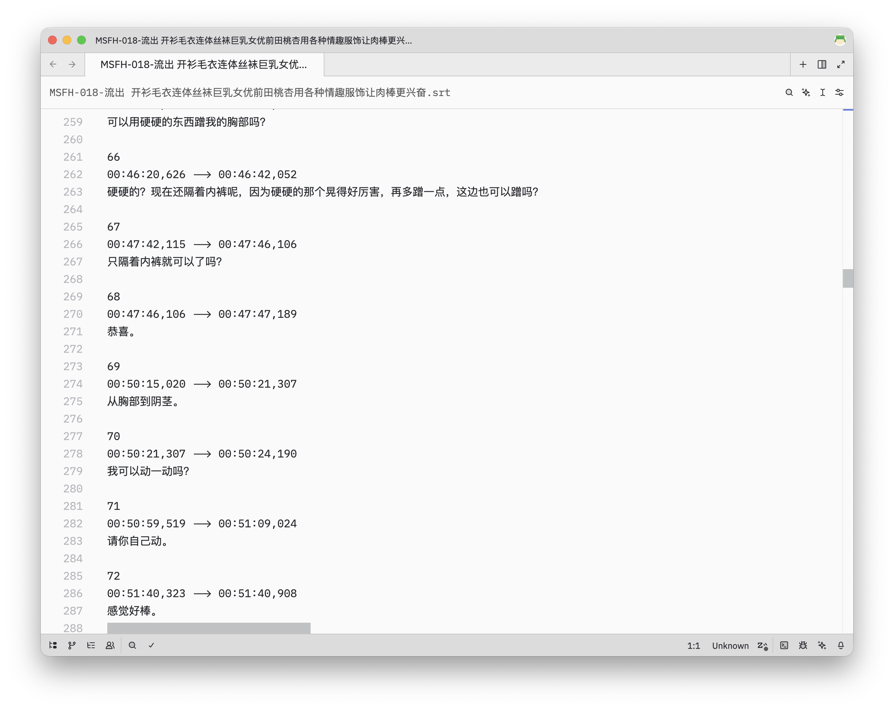

今天刷 V2EX 看到有人做了个【[日本小电影提取字幕并翻译的工具](https://www.v2ex.com/t/1200245)】，而且编译了 macOS 的版本，正好有几部喜欢的片子没字幕的，直接试试。

之前也有人做了类似的工具，叫 **[WhisperJAV](https://github.com/meizhong986/WhisperJAV)** ，我试了下发现有 BUG ，只提取出了字幕没有翻译，就懒得介绍了。

## 使用

这个用起来相当傻瓜了，字幕提取模型选默认的 large-v3-trubo 就行，能直接从中国大陆的镜像源下载。

我的是 M4 MacBook Air ，提取这部 MSFH-010 的字幕大约花了十几分钟，效率还是很高的。

翻译模型我用了 gemini-3.1-flash-lite ，直接用 Google AI Studio 的免费 API ，翻译了 116 行字幕调用了 9 次 API，免费额度是完全够用的。

## 下载

**[Caption-Trans](https://github.com/cddqssc/Caption-Trans/releases)**