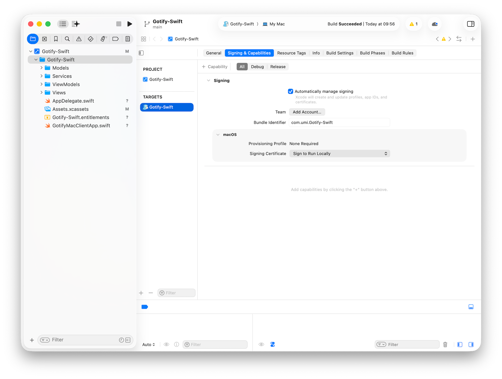
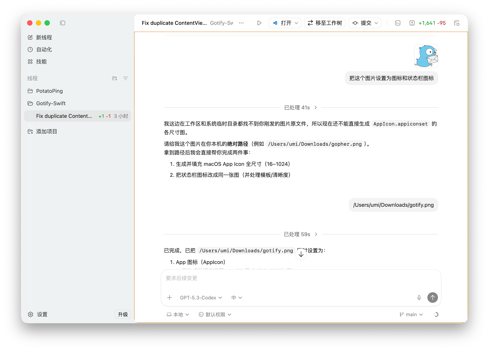
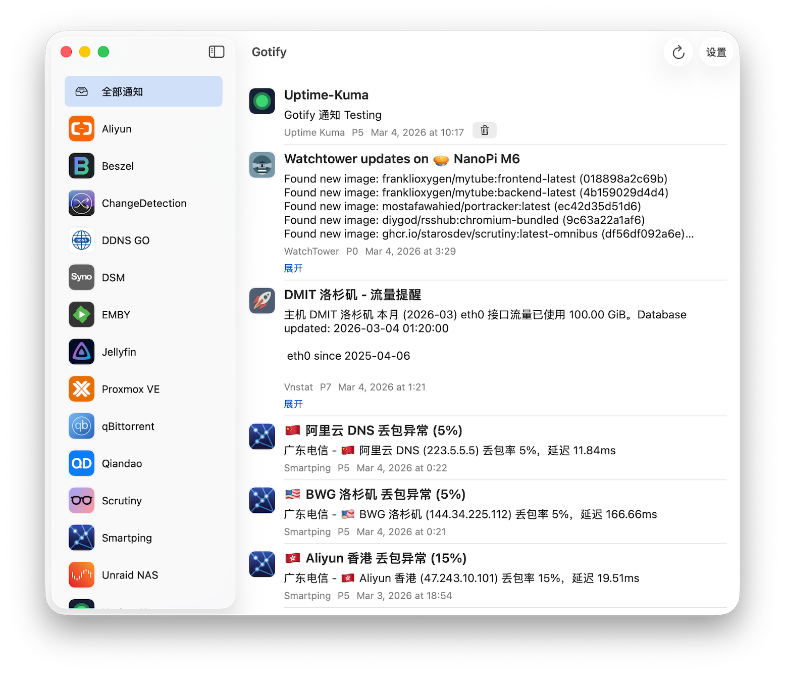
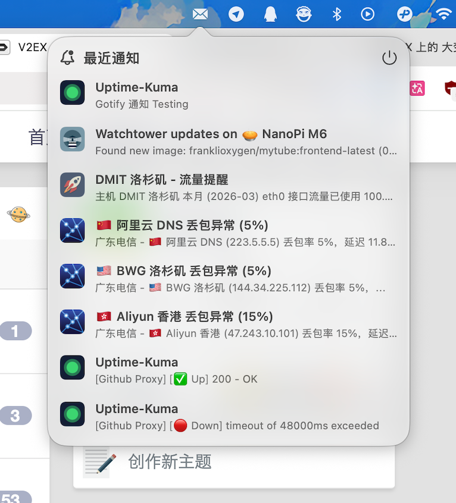
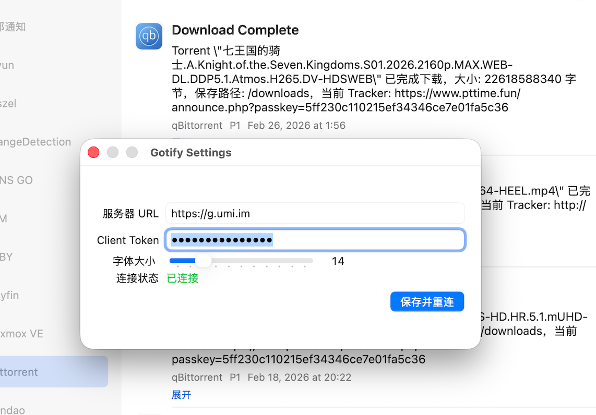

## 前言

我使用了一个叫 Gotify 的自托管应用来接受各种消息（类似电报 Bot），它官方只有 Android 客户端，但是 Windows 和 iOS 都有人开发第三方客户端，唯独没有人开发 macOS 客户端。

既然如此只能自己动手了，现在 AI 编程这么发达，已经不难吧？

在真正动手前发现已经有人搞出来了 [gotify-desktop-macos](https://github.com/itsamenathan/gotify-desktop-macos) ，赶紧下来试用一下，发现是用 Tauri (Rust) + React 开发的，会启动一个 Webkit 进程，几个进程加起来占用了四五百兆内存，UI 也不怎么好看，还得自己动手。

## 开发环境

目前最火的 AI 编程工具是 Claude Code ，不过它是 CLI 界面的，作为零基础小白，我选择了 OpenAI 的 Codex ，至少它还有中文 GUI 和够用的免费额度...

模型用默认的 GPT-5.3-Codex 。

当然，开发 macOS APP 还得安装 CodeX ，安装过程就不说了，很简单。

## 开始 Vibe Coding

我先问了 Gemini 开发 APP 要用啥提示词。

> 我想开发一个 macOS 原生应用，作为 Gotify 的客户端。使用 SwiftUI。界面要简洁，有一个设置页面输入服务器 URL 和 Client Token。主页面显示最近收到的消息列表。
>
> 现在请实现 WebSocket 链接功能。当应用启动时，根据设置里的 URL 链接到 Gotify。收到新消息时，调用 macOS 系统原生通知弹出提醒，并更新列表。即使窗口关闭，应用也要在后台运行。

Codex 很快写出来代码，然后我才反应过来，应该得在 Xcode 里先创建 APP 再让 Codex 去写代码吧？

不管了，用 Xcode 创建了 APP ，再把 Codex 的代码拷贝到 Xcode 上，点击左侧边栏上的 Play 一样的图标就能编译起来，果不其然报错了。



因为拷贝的时候很多代码混在了一起，让 Codex 帮我整理一下。

```
Multiple commands produce '/Users/umi/Library/Developer/Xcode/DerivedData/Gotify-Swift-gvresuiejgfxpjeyqqbgenygnkxt/Build/Intermediates.noindex/Gotify-Swift.build/Debug/Gotify-Swift.build/Objects-normal/arm64/ContentView.stringsdata'  
帮我整理下代码
```

整理完编译起来了就弹出 APP 的运行窗口了，打开设置图标报错，直接把报错信息发给 Xcode ，让它干活就是了。

```
程序运行成功了，但在点击设置按钮时，Xcode 提示：‘Please use SettingsLink for opening the Settings scene’。请帮我把打开设置界面的代码改用 SwiftUI 官方推荐的 SettingsLink 方式实现。
```

遇到的唯一棘手的问题是 APP 无法登录，在 Xcode 里的 Signing & Capabilities 项里把 App Sandbox 项删掉，让 APP 不在沙箱里运行减少出错。

但还是一直登录报错：

```
Unable to obtain a task name port right for pid 600: (os/kern) failure (0x5)
ViewBridge to RemoteViewService Terminated: Error Domain=com.apple.ViewBridge Code=18 "(null)" UserInfo={com.apple.ViewBridge.error.hint=this process disconnected remote view controller -- benign unless unexpected, com.apple.ViewBridge.error.description=NSViewBridgeErrorCanceled}
```

经过几回拉扯 CodeX 终于搞定了，登录成功。

```
你这个现象已经能解释通了，我刚修了根因：

之前旧连接被 disconnect() 后，会回调 Socket is not connected
这个旧回调又触发重连，反过来把新连接打断
结果就是你日志里每 3 秒一次 101，看起来像一直“连接中”
我已做的修复：

在 GotifyWebSocketService.swift 增加 activeConnectionID（连接代际）
只有“当前连接”的回调才允许触发失败和重连
旧连接的失败回调会被忽略
错误信息改成 domain(code)+description，便于定位
.im 域名不是问题，这次更像客户端重连逻辑导致自我打断。

请重新打包测试一次。如果还异常，把“最近错误”完整文本贴我（现在会带错误码，比如 NSPOSIXErrorDomain(57) 或 NSURLErrorDomain(-1005)），我可以继续精确到代理或 TLS 层。
```

后面都是改需求打磨 UI 的问题了就不写了，图标素材都扔给 CodeX 处理了。



## 打包 APP

点击 Xcode 状态栏的 Product 下的 Show Build Folder in Finder ，进入 Product/Debug 目录就能看到看到编译好的 .app 文件了，直接就能拖拽安装，如果要分发给别人使用安装后还要运行：`xattr -cr /Applications/Gotify-Swift.app` 。

## 运行截图

主界面



状态栏窗口



设置界面



除了解决登录那里卡了一会，几十分钟就能整出一个完成度很高的 macOS APP 了。

时代真的变了，零基础小白一两小时就能开发一个桌面 APP 了。

现在不差程序员了，只差一个产品经理。

## 源代码

[Gotify-Swift](https://github.com/ariakeumi/Gotify-Swift)
